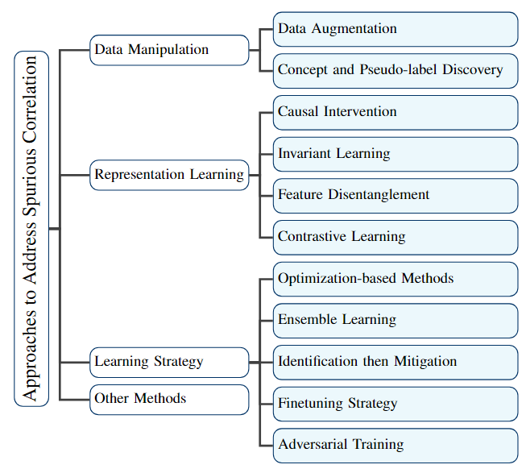

# Spurious Correlations in Machine Learning: A Survey [](https://github.com/sindresorhus/awesome)

[](https://opensource.org/licenses/MIT) 

Machine learning systems are known to be sensitive to spurious correlations between biased features of the inputs (e.g., background, texture, and secondary objects) and the corresponding labels. These features and their correlations with the labels are known as "spurious" because they tend to change with shifts in real-world data distributions, which can negatively impact the model's generalization and robustness. In this survey, we provide a comprehensive review of this issue, along with a taxonomy of current state-of-the-art methods for addressing spurious correlations in machine learning models. Additionally, we summarize existing datasets, benchmarks, and metrics to aid future research. The paper concludes with a discussion of the recent advancements and future research challenges in this field, aiming to provide valuable insights for researchers in the related domains.    



Here is a collection of research papers and the relevant valuable open-source resources for Spurious Correlations in Machine Learning. Watch this repository for the latest updates and **feel free to raise pull requests if you find some interesting papers**!

Our survey paper on arxiv: [Spurious Correlations in Machine Learning: A Survey](https://arxiv.org/abs/2402.12715v1) 

```python
@article{ye2024spurious,
  title={Spurious Correlations in Machine Learning: A Survey},
  author={Ye, Wenqian and Zheng, Guangtao and Cao, Xu and Ma, Yunsheng and Hu, Xia and Zhang, Aidong},
  journal={arXiv preprint arXiv:2402.12715},
  year={2024}
}
```

## Table of Contents

- [Articles](#articles)
- [Datasets](#datasets)
- [Papers](#papers)


## Datasets

|  Dataset  |  #Class  |  #Sample  |  Brief Description  |  Domain  | 
|----------------------------|------|-------------------------|-----------------------------------|--------------------------|
| Colored MNIST |  -  |  60,000  |  Synthetic Dataset  |  Vision  |    
| Corrupted CIFAR-10 |  -  |  60,000  |  Synthetic Dataset  |  Vision  |    
| CelebA |  2x2  |  202,599  |  Face Attribute  |  Vision  |    
| Waterbirds |  2x2  |  11,788  |  Bird Subset of CUB  |  Vision  |    
| ImageNet-9 | 9 | 5,495 | Subset of ImageNet | Vision | 
| ImageNet-A | 200 | 7,500 | Subset of ImageNet | Vision | 
| ImageNet-C | 75 | - | Subset of ImageNet | Vision | 
| BAR | 6 | 2,595 | Action | Vision | 
| NICO | 19 | 24,214 | Animal and Vehicle | Vision | 
| MetaShift | 410 | 12,868 | Natural Images | Vision | 
| FMOW | 63 | 1,047,691 | Satellite Images | Vision | 
| Spawrious | 6x4 | 152,064 | Dog | Vision | 
| CivilComments | 7 | 1,999,514 | Public Comment | Text | 
| MultiNLI | 3x2 | 206,175 | Language Inference | Text |
| FDCL18 | 7 | 80,000 | Abusive Behavior | Text |
| IV-VQA | - | 657,090 | Causal VQA | VQA |
| CV-VQA | - | 59,513 | Causal VQA | VQA |
| ChestX-ray14 | 14 | 112,120 & Chest X-Ray | Health |
| MIMIC-CXR | - | 377,110 | Chest X-Ray | Health |
| CheXpert | 14 | 224,316 | Chest X-Ray | Health |
| PadChest | 19 | 160,868 | Chest X-Ray | Health | 


## Articles
- [Spurious Correlations in Machine Learning](https://www.doczamora.com/spurious-correlations-in-machine-learning)
- [Spurious Correlation: Definition, Examples & Detecting](https://statisticsbyjim.com/basics/spurious-correlation/)
- [Spurious Correlation: Definition, How It Works, and Examples](https://www.investopedia.com/terms/s/spurious_correlation.asp)
- [Why Correlation-Based Machine Learning Leads to Bad Predictions](https://causalens.com/resources/white-papers/why-correlation-based-machine-learning-leads-to-bad-predictions/)
- [How Causal Inference Helps Machine Learning Models Avoid Spurious Correlations and Make Informed Decisions](https://www.linkedin.com/pulse/how-causal-inference-helps-machine-learning-models-avoid-harrison/)

## Datasets


## Papers
